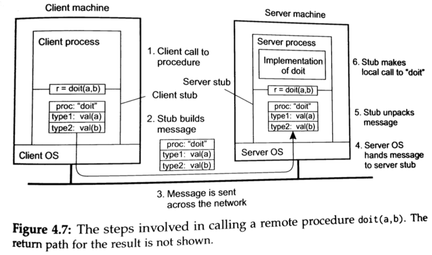

# What is this?
It is an example system that implements a Remote Procedure Call mechanism as illustrated below in a figure from _Distributed Systems 3rd ed._,
by Maarten van Steen and Andrew S. Tanenbaum

  

In addition, a mechanism is also included to keep a list of objects that can be accessed remotely.  Therefore in program (including the test programs in
this repository), it is possible to make an object available very simply:

	ExampleClass example = new ExampleClass();
	registry.register("example", example);
  
The registered object can be accessed very simply as well:  
 
    remote = (ExampleClass) registry.find("Remoteexample");  
    remote.test(5);  

# Files
Interface - interface definitions  
Implementation - Classes  
Tests - JUnit tests for some of the trickier components to implement  
Demo Programs - client/server demonstrating a complete end-to-end test  
  

# How Do I Run It

	@Override
	public String test(Integer parameter) {
		System.out.println("Received a test method call with parameter: " + parameter);
		return "Returned this String after receiving: "+parameter ;
	}

1. Compile the code
2. From the RPCPlayground/demo-programs/clientserver run ExampleServer.java.  It will display the following lines on the console:
    >Creating a registry component to store objects that may be accessed remotely  
    >Directing remote calls to objects in the registry  
    >Listening for TCP/IP connections on port 5000  
    
3. RPCPlayground/demo-programs/clientserver run ExampleServer.java.  It will run to completion and display the following lines on the console:
    >Delaying for 5 seconds to give the other side time to complete initial configuration  
    >Local registry: Local objects:  
    >[ClientRegistry]  
    >Remote objects:  
    >[Serverme, ServerRegistry]  
    >Result of remote call: Returned this String after receiving: 5  
    >Finished  

   In addition, the console for ExampleServer.java will have some additional output after the client starts:
    >Registering a test component with both sides of the connection  
    >Local registry: Local objects:  
    >[Serverme, ServerRegistry]  
    >Remote objects:  
    >[ClientRegistry]  
    >Received a test method call with parameter: 5  
    >Finished  

# Internal Design
  
  
  
  
